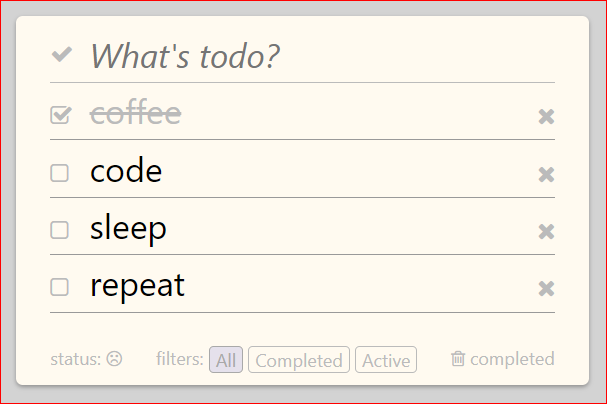

# Todo live coding

## Exercise 2
You are tasked with adding filtering to the todo app. The designer has provided us with a mock (see below), which we should try to faithfully recreate.

Your feature should include tests.



## Getting started

```bash
# checkout branch exercise 2
git checkout exercise2

# create a new branch for your fix
git checkout -b task/[first-last]

$ npm start
# browse to http:\\localhost:3000

# code!

# make a commit with your feature
git add *
git commit -m '[description of your feature]'
```
